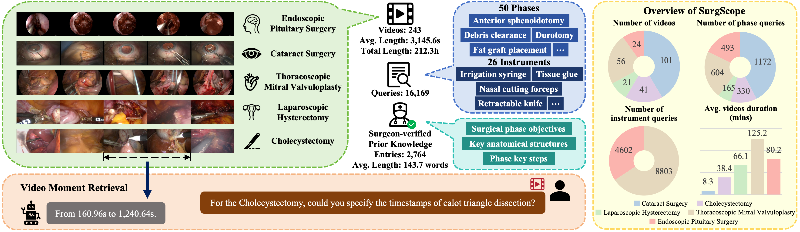
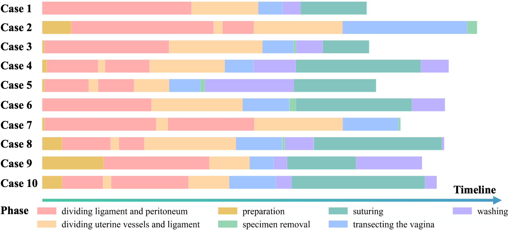

# SurgScope: A Multi-Type Surgical Benchmark with Prior Knowledge for Long Video Moment Retrieval

## Authors

**Wanjing Zhou1**, **Haozhe Yang1**, **Mengze Li2,***, **Yuqi Fang1**, and **Wei Ji3,***

1 Nanjing University, Suzhou, Jiangsu, China 2 Hangzhou Dianzi University, Hangzhou, Zhejiang, China 3 State Key Laboratory for Novel Software Technology, Nanjing University, Nanjing, Jiangsu, China

* Corresponding authors.

**Contact:**
Wanjing Zhou: [wanjingzhou@smail.nju.edu.cn](mailto:wanjingzhou@smail.nju.edu.cn)
Haozhe Yang: [yhz@smail.nju.edu.cn](mailto:yhz@smail.nju.edu.cn)
Mengze Li: [mengzeli@zju.edu.cn](mailto:mengzeli@zju.edu.cn)
Yuqi Fang: [yqfang@nju.edu.cn](mailto:yqfang@nju.edu.cn)
Wei Ji: [weiji@nju.edu.cn](mailto:weiji@nju.edu.cn)

## Abstract

Efficiently locating clinically relevant moments in long surgical videos is essential for surgical education, yet the medical domain still lacks a dedicated benchmark for surgical video moment retrieval (VMR). A practical benchmark should include both a clinically grounded dataset and strong baselines, yet building such a benchmark is challenging in two aspects. Dataset construction requires reliable expert temporal annotations and medically grounded prior knowledge. Baseline construction, meanwhile, must handle substantial redundancy and sparse target moments in long surgical videos under limited input budgets, while also making effective use of domain-specific prior knowledge for retrieval. To address these issues, we introduce SurgScope, a benchmark for surgical VMR built from long real surgical videos across five procedure types. SurgScope provides expert-annotated temporal boundaries and surgeon-verified prior knowledge, and supports both phase localization and instrument localization. We further establish a strong baseline with two key components: Domain-specific Prior-knowledge Prompting and Redundancy-guided Dynamic Sampling (RDS). The former injects surgeon-verified prior knowledge into the prompt for knowledge-assisted retrieval, while the latter suppresses redundant frames to improve video input efficiency. Experiments show that SurgScope is challenging for current MLLM-based VMR methods, while fine-tuning on SurgScope substantially improves performance. Domain-specific prior knowledge benefits phase localization, and RDS consistently outperforms default sampling strategies. SurgScope is publicly available at [https://anonymous.4open.science/r/MM-SurgScope-0B27/README.md](https://github.com/yhz2003/SurgScope).

## Dataset

<u>**Download**</u>

- Surgical Videos: https://pan.baidu.com/s/1czUmNRYBvrJS3I_mpc4szg?pwd=ck94
- Annotations: All annotation files are located in the `data/` directory.

**Figure 1: Illustration of phase annotation timelines for selected laparoscopic hysterectomy cases.**

## Appendix

### Performance of MLLMs For Instrument Localization

Since the main paper has already reported the instrument-query evaluation results of **TimeChat**, here we further evaluate **VTimeLLM** on instrument localization task. 

As shown in Table 1, Starting from the original VTimeLLM checkpoint, fine-tuning already brings clear improvements over the zero-shot setting. More importantly, replacing conventional random sampling with Redundancy-guided Dynamic Sampling (RDS) further improves performance, with mIoU increasing from 8.21 to 8.47, `R1@0.3` from 6.75 to 8.44, and `R1@0.5` from 2.53 to 2.95. This indicates that RDS can provide more informative training clips even without additional phase-aware initialization.

The results in Table 2 further examine the case where instrument localization is fine-tuned from the phase localization fine-tuned weights. Under this controlled setting, RDS again consistently outperforms Uniform sampling, improving mIoU from 9.98 to 10.12, `R1@0.3` from 7.81 to 8.65, and `R1@0.5` from 1.27 to 2.32. This verifies that the gain mainly comes from the clip construction strategy rather than from differences in initialization. 

Overall, RDS is more effective than conventional sampling strategies for VTimeLLM, and that combining it with phase-aware initialization yields the strongest overall performance on instrument localization.

**Table 1: Performance of fine-tuned (FT) VTimeLLM variants for instrument localization initialized from the original VTimeLLM checkpoint.**

| Model                                              |     mIoU |   `R1@0.3` |   `R1@0.5` |   `R1@0.7` |
| -------------------------------------------------- | -------: | -------: | -------: | -------: |
| VTimeLLM (Zero-shot)                               |     8.04 |     6.96 |     1.90 |     1.05 |
| VTimeLLM (VTimeLLM weights + FT, Uniform sampling) |     8.21 |     6.75 |     2.53 |     **1.48** |
| **VTimeLLM (VTimeLLM weights + FT, RDS)**          | **8.47** | **8.44** | **2.95** | **1.48** |

**Table 2: Performance of fine-tuned (FT) VTimeLLM variants for instrument localization initialized from phase localization fine-tuned weights.**

| Model                                             |      mIoU |   `R1@0.3` |   `R1@0.5` |   `R1@0.7` |
| ------------------------------------------------- | --------: | -------: | -------: | -------: |
| VTimeLLM (Zero-shot)                              |     8.04 |     6.96 |     1.90 |   **1.05** |
| VTimeLLM (Phase FT weights + FT, Uniform sampling) |      9.98 |     7.81 |     1.27 |     0.42 |
| **VTimeLLM (Phase FT weights + FT, RDS)**         | **10.12** | **8.65** | **2.32** | 0.42 |

As shown in Table 4, we evaluates transfer from phase localization to instrument localization without additional instrument-task fine-tuning. Using Phase fine-tuned weights improves coarse localization performance over the zero-shot setting for both TimeChat and VTimeLLM, showing that phase-level supervision provides useful transferable knowledge. RDS further improves mIoU and `R1@0.3`, while gains at stricter IoU thresholds remain limited.

**Table 4: Comparison of transfer strategies for instrument localization with dynamically constructed surgical clips.**

| Model                                         | mIoU      | `R1@0.3`    | `R1@0.5`   | `R1@0.7`   |
| --------------------------------------------- | --------- | --------- | -------- | -------- |
| TimeChat (Zero-shot)                          | 2.70      | 3.77      | 1.42     | 0.00     |
| TimeChat (Phase FT weights, Random sampling) | 10.09     | 9.70      | **4.01**     | **1.05**     |
| **TimeChat (Phase FT weights, RDS)**          | **10.35** | **10.13** | 2.74 | 0.63 |
| VTimeLLM (Zero-shot)                              |     8.04 |     6.96 |     1.90 | **1.05** |
| VTimeLLM (Phase FT weights, Uniform sampling) |      9.93 |     7.17 |     1.27 |     0.42 |
| **VTimeLLM (Phase FT weights, RDS)**              |  **9.97** | **8.02** | **2.32** |     0.21 |

### Performance of MLLMs With Domain-specific Prior-knowledge Prompting

Tables 5 and 6 show that Domain-specific Prior-knowledge Prompting (DPKP) is most effective when applied only at evaluation. We compare different usages of DPKP for phase localization with fine-tuned TimeChat under random sampling and RDS, respectively. In both settings, applying DPKP only at evaluation yields the best coarse localization performance. Under random sampling, DPKP at evaluation improves mIoU from 48.47 to 52.13 and `R1@0.3` from 72.22 to 78.14. A similar trend is observed with RDS, where mIoU increases from 50.38 to 52.54 and `R1@0.3` from 74.55 to 77.24. In contrast, introducing DPKP in both training and evaluation does not bring further gains and even degrades several metrics. These results suggest that domain-specific prior knowledge is most effective as complementary contextual guidance at inference time, while directly incorporating it into fine-tuning may interfere with the model’s original temporal grounding behavior.

**Table 5. Performance of fine-tuned (FT) TimeChat with Random sampling for phase localization under different usages of Domain-specific Prior-knowledge Prompting (DPKP).**

| Model                                                        | mIoU      | `R1@0.3`    | `R1@0.5`    | `R1@0.7`    |
| ------------------------------------------------------------ | --------- | --------- | --------- | --------- |
| TimeChat (FT with Random sampling)                           | 48.47     | 72.22     | 53.23     | **26.70** |
| TimeChat (FT with Random sampling, DPKP at evaluation)       | **52.13** | **78.14** | **58.78** | 26.16     |
| TimeChat (FT with Random sampling, DPKP in training and evaluation) | 48.94     | 73.48     | 51.43     | 26.52     |

**Table 6. Performance of fine-tuned (FT) TimeChat with RDS for phase localization under different usages of Domain-specific Prior-knowledge Prompting (DPKP).**

| Model                                                   | mIoU      | `R1@0.3`    | `R1@0.5`    | `R1@0.7`    |
| ------------------------------------------------------- | --------- | --------- | --------- | --------- |
| TimeChat (FT with RDS)                                  | 50.38     | 74.55     | 55.02     | **31.72** |
| **TimeChat (FT with RDS, DPKP at evaluation)**          | **52.54** | **77.24** | **58.24** | 29.57     |
| TimeChat (FT with RDS, DPKP in training and evaluation) | 49.33     | 75.99     | 51.43     | 25.45     |

